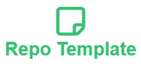

  

  

    Template for HU-Lee's repositories
     
     
    <a href="https://github.com/BeaverHouse/repo-template/issues">Bug Report</a>
    |
    <a href="https://github.com/BeaverHouse/repo-template/issues">Request to HU-Lee</a>
  

  

    
    
    
  

<!-- Content -->

 

## Description

Template for [HU-Lee][hulee]'s repositories.

- [Community Standards][community-standards]
  - [README template][readme]
- CODEOWNERS
- Various workflows
  - Sync template files: [BetaHuhn/repo-file-sync-action][wf1]
  - Sync labels: [micnncim/action-label-syncer][wf2]
  - [CodeQL][codeql]
  - Deploy & Dry-run for Yarn

[hulee]: https://github.com/HU-Lee
[community-standards]: https://github.com/BeaverHouse/repo-template/community
[readme]: ./README-template.md
[codeql]: https://codeql.github.com/
[wf1]: https://github.com/BetaHuhn/repo-file-sync-action
[wf2]: https://github.com/micnncim/action-label-syncer

 

## Limitation

README has too many variations, so I just ended up with making a simple template.

 

## Other tips

You can find some emojis 🚀🚀 at https://emoji.julien-marcou.fr/  
You can find some badges at https://ileriayo.github.io/markdown-badges/

 

## Contributing

See the [CONTRIBUTING.md][contributing].

[contributing]: ./CONTRIBUTING.md
